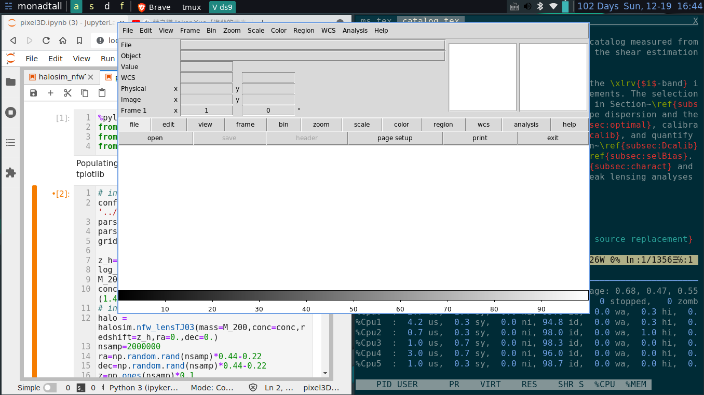

# Demo





# prerequisite

## Fonts

```shell
sudo pacman -S terminus-font # TTY
sudo pacman -S adobe-source-code-pro-fonts # source code font
sudo pacman -S nerd-fonts # for emoji
```

## Build-essential

```shell
sudo pacman -S base-devel neovim zsh xterm tmux ripgrep nodejs npm
```
## tmux

```shell
git clone https://github.com/tmux-plugins/tpm ~/.tmux/plugins/tpm
```

## Rofi

```shell
sudo pacman -S rofi
```

## vim

```shell
sh -c 'curl -fLo "${XDG_DATA_HOME:-$HOME/.local/share}"/nvim/site/autoload/plug.vim --create-dirs \
       https://raw.githubusercontent.com/junegunn/vim-plug/master/plug.vim'
```

## GTK3 theme
[gruvbox](https://github.com/3ximus/gruvbox-gtk.git)

## others
[other useful packages](http://member.ipmu.jp/xiangchong.li/usefulpac)

# Install

```shell
git clone --bare https://github.com/mr-superonion/dotfiles.git $HOME/dotfiles
alias config='/usr/bin/git --git-dir=$HOME/dotfiles/ --work-tree=$HOME'

mkdir -p config-backup

config checkout
if [ $? = 0 ]; then
  echo "Checked out config.";
else
    echo "Backing up pre-existing dot files.";
    config checkout 2>&1 | egrep "\s+\." | awk {'print $1'} | xargs -I{} bash -c 'mkdir -p config-backup/$(dirname {}); mv {} config-backup/{}'
fi;

config checkout
config config status.showUntrackedFiles no
```
