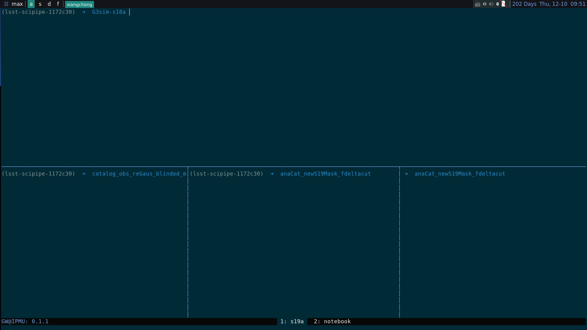

# Demos
{ width=800px }


# prerequisite

## Build-essential

### Arch

```shell
sudo pacman -S base-devel neovim zsh xterm
```
### Debian
```shell
sudo apt-get install build-essential zsh xterm vim
```

## Shell

```shell
wget https://raw.githubusercontent.com/ohmyzsh/ohmyzsh/master/tools/install.sh
sh install.sh
```


## Dmenu

```shell
git clone https://github.com/mr-superonion/dmenu.git

cd dmenu

git checkout patched
make install
```

## vim

```shell
sh -c 'curl -fLo "${XDG_DATA_HOME:-$HOME/.local/share}"/nvim/site/autoload/plug.vim --create-dirs \
       https://raw.githubusercontent.com/junegunn/vim-plug/master/plug.vim'
pip3 install --user pynvim
```

# Install

```shell
git clone --bare https://github.com/mr-superonion/dotfiles.git $HOME/dotfiles
alias config='/usr/bin/git --git-dir=$HOME/dotfiles/ --work-tree=$HOME'

mkdir -p config-backup

config checkout
if [ $? = 0 ]; then
  echo "Checked out config.";
else
    echo "Backing up pre-existing dot files.";
    config checkout 2>&1 | egrep "\s+\." | awk {'print $1'} | xargs -I{} bash -c 'mkdir -p config-backup/$(dirname {}); mv {} config-backup/{}'
fi;

config checkout
config config status.showUntrackedFiles no
```
